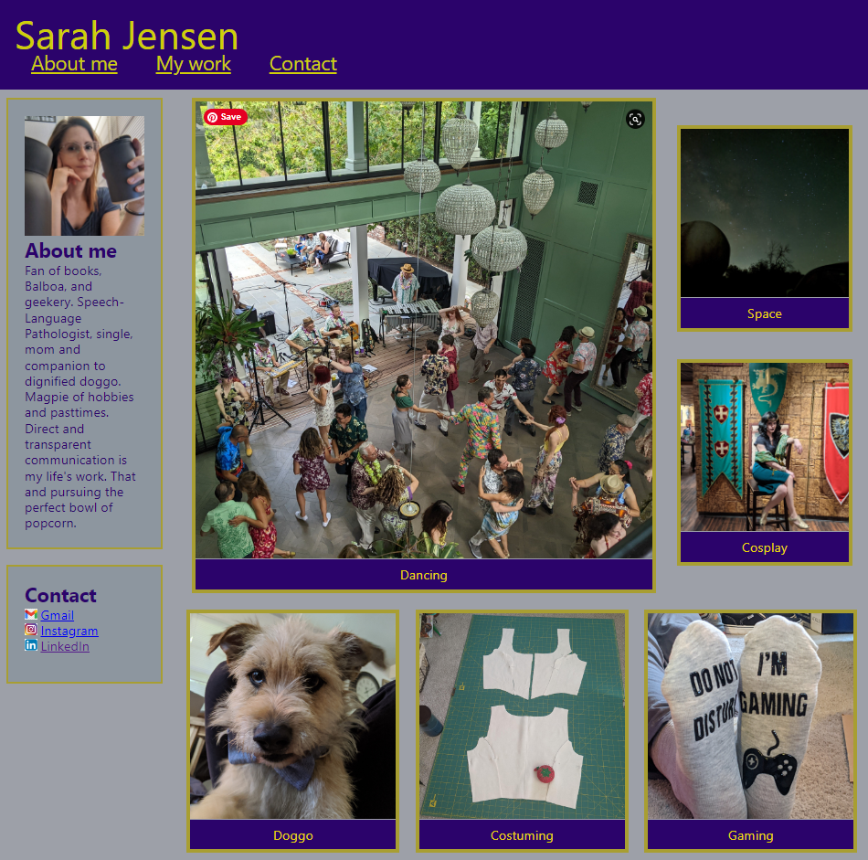

# portfolio

## Create developer portfolio using HTML and CSS

The purpose of this project was to practice writing HTML and CSS from scratch in order to build a portfolio to display web development projects, as well as to practice responsive design using media queries.
I learned and practiced a variety of skills related to using multiple flexboxes in a single flexbox container, using multiple selectors to target multiple HTML elements, and determining appropriate selectors to target with media queries. The importance of committing changes often was reinforced with the many types of changes I ended up making to each element.

## Installation

N/A

## Usage

View the webpage to see information about and contact information for the developer as well as placeholder images for future projects. These placeholders will be replaced as projects are developed and deployed.

View the webpage here: https://sarah-jensen.github.io/portfolio/

## Credits

Assets and starter code provided by UC Berkeley Extension. 
Logo images attributed to https:www.vecteezy.com

## License

Refer to the LICENSE in the repo.

---
